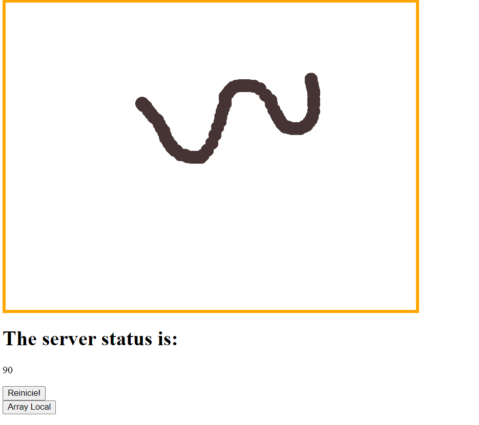
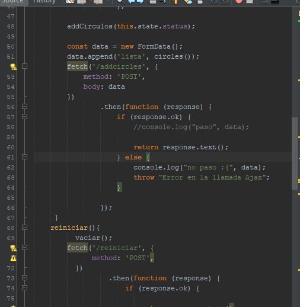
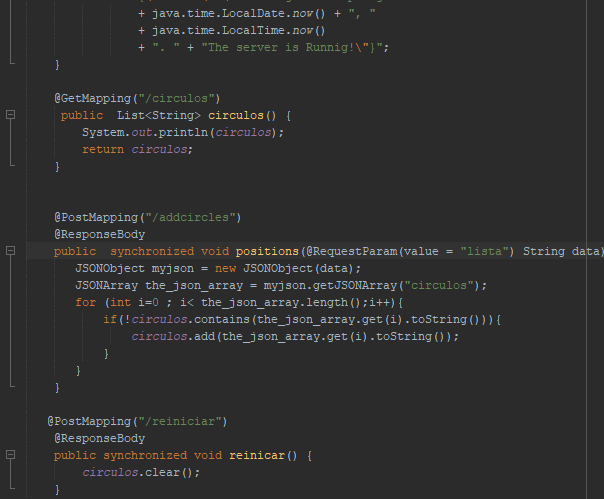
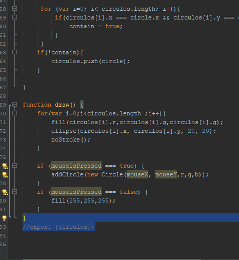

# Tablero Interactivo de Dibujo Multiusuario
Esta aplicación permite dibujar con varios usuarios un mismo tablero.


## Autor

* **J. Eduardo Arias Barrera** - *Initial work* - [AriasAEnima](https://github.com/AriasAEnima)

## Link Heroku

https://tablero-concurrente.herokuapp.com/dibujar.html


## Rendimiento LOC/h

LOC=5 LOC/h

### Prerrequisitos

Java JDK 1.8, Maven y Git.

* [JAVA JDK 8](http://www.oracle.com/technetwork/java/javase/overview/index.html) - Version de Java
* [Maven](https://maven.apache.org/) - Maven
* [JUnit 3.8.1](https://mvnrepository.com/artifact/junit/junit/3.8.1) - Para Pruebas

## Para empezar

Se debe ejecutar en la carpeta que queremos que esté
```
> git clone https://github.com/AriasAEnima/React-Spring-Primer.git
```
### Instalación

Primero ejecutamos maven en la carpeta raiz, esto compilara el aplicativo

```
> mvn package
```

## Ejecución

Utilizaremos este comando:
```
> mvnw spring-boot:run

```

Y nos deberá arrojar algo similar:



## Diseño Utilizado

###  **En react**



###  **En Spring**



###  **En p5**




## Documentación:

Se encuentra en la carpeta
```
> cd src/site/
```

## Licencia

This project is licensed under the MIT License  - see the [LICENSE](LICENSE) file for details
